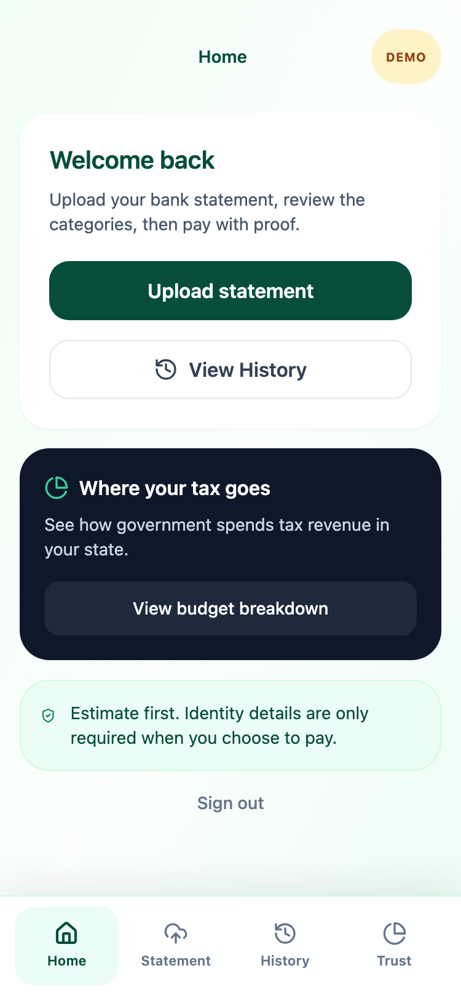
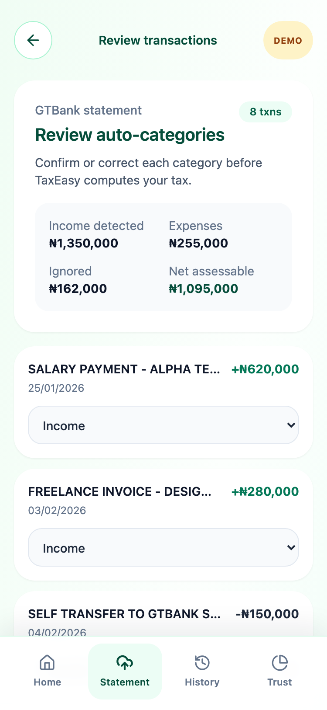
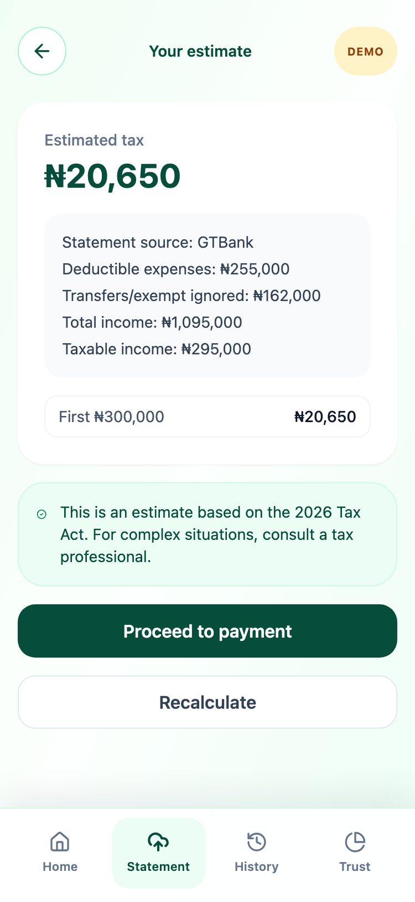
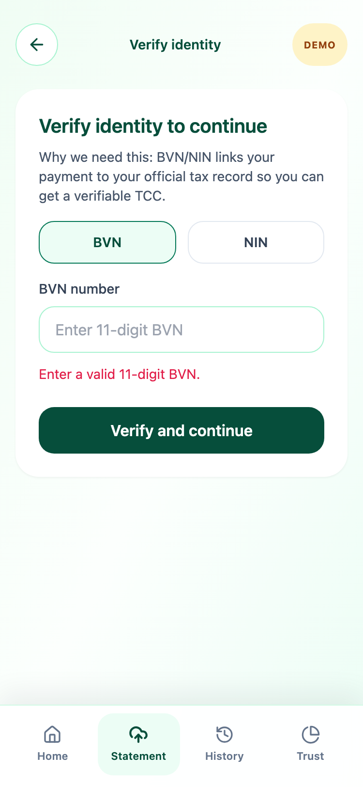

# TaxEasy: Pay your tax in under 90 seconds

TaxEasy is a mobile-first, zero-friction web application designed to help Nigerian SMEs, freelancers, salary earners with side income, and informal earners understand and pay tax from real financial activity. Users upload a bank statement PDF, review auto-categorized transactions, calculate what they owe, pay, and receive instant proof.

Our core philosophy is built on three pillars: **Simplicity** (statement upload before manual forms), **Proof** (instant QR receipts and downloadable Tax Clearance Certificates), and **Trust** (a Transparency Layer showing exactly how your state spends tax revenue).

**Live Demo:** [Insert Deployed URL Here]

---

## 1. The Problem We Solve

In Nigeria, nearly half of small earners — 48% — either don't pay tax or don't know how. The system isn't broken because people refuse to pay; it's broken because the existing tools are too confusing, opaque, and demanding to even try. 

Our survey of 23 respondents validated this: 71% do not pay tax or do not know how to pay, 57% have unreported side income, and users abandon flows when asked for their BVN before seeing their tax bill (a 17.4% comfort gap). Furthermore, 82.6% stated they would be willing to pay *if* they could see where their money was actually going. TaxEasy was built directly in response to this data.

---

## 2. Screenshots

*(Screenshots captured at 375px mobile width)*

| Home Dashboard | Statement Review | Calculation Result |
| :---: | :---: | :---: |
|  |  |  |

| Receipt (with QR) | TCC PDF Preview | Transparency Layer |
| :---: | :---: | :---: |
|  | [Generated during demo via TCC button] |  |

---

## 3. Demo Access

- **Live Production URL:** [Insert Deployed URL Here]
- **Demo Mode:** Append `?demo=true` to the URL (e.g., `https://taxeasy.vercel.app/?demo=true`). 

*Note: Activating Demo Mode safely populates the app with 3 historical mock payments and a sample parsed GTBank statement. No real data is stored or transmitted.*

---

## 4. Tech Stack

**Next.js 14, React, TypeScript, Tailwind CSS, Supabase, @react-pdf/renderer, qrcode.react, lucide-react**

---

## 5. Local Setup

Run the project locally in under 5 minutes:

1. **Clone the repository:**
   ```bash
   git clone https://github.com/your-org/taxeasy.git
   cd taxeasy
   ```
2. **Install dependencies:**
   ```bash
   npm install
   ```
3. **Configure Environment:**
   Copy the example environment file:
   ```bash
   cp .env.example .env.local
   ```
   *(Note: Supabase keys are optional for the core MVP runtime, as app state relies entirely on browser `localStorage`.)*
4. **Run the Development Server:**
   ```bash
   npm run dev
   ```
5. **Open the App:**
   Navigate to `http://localhost:3000/?demo=true` in Chrome and toggle Developer Tools to Device Mode (375px width).

---

## 6. Project Structure

```text
├── app/                  # Next.js App Router (page.js is the main MVP state machine)
├── components/           # Reusable React components (TccPDF)
├── docs/                 # Architecture, Decisions, and Screenshots
├── lib/                  # Pure utility functions (taxCalculator.ts, bankStatement.ts, transparencyData.ts)
├── tests/                # Unit tests for the tax calculator
├── DEMO_SCRIPT.md        # The 5-minute presentation script
└── TECH_DEBT.md          # Technical debt and future migration plans
```

---

## 7. Documentation

For a deeper dive into the product thinking and technical architecture of TaxEasy, review our core documentation:

- [Demo Presentation Script](DEMO_SCRIPT.md)
- [Architecture Overview](docs/architecture.md)
- [Decision Log](docs/DECISIONS.md)
- [Technical Debt & Limitations](TECH_DEBT.md)

---

## 8. Known Limitations

The current MVP is optimized for UX demonstration and speed. It parses one representative GTBank statement format and uses seeded sample statements for other banks. It relies on `localStorage` for session history, which means data is tied to the specific browser and device. Identity verification and payments are mocked to bypass regulatory overhead, meaning the platform is not currently secure for real financial transactions. For a complete list of limitations and migration plans, see [TECH_DEBT.md](TECH_DEBT.md).

---

## 9. The Team

[Team names to be added before submission]

*TS Academy Product Management Capstone, Group [N], GovTech/Public Services theme*
