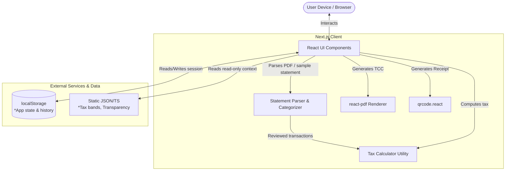
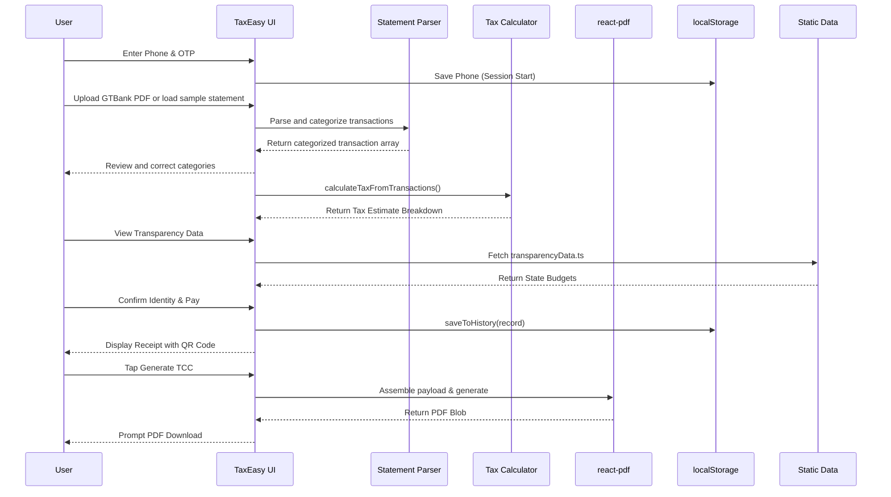

# TaxEasy MVP Architecture

TaxEasy operates as an entirely client-side Next.js application. We chose this architecture specifically for demo reliability (no backend latency during a 5-minute presentation), data privacy (sensitive identity, statement, and income data never leaves the device), and a radically reduced deployment surface area. Everything from statement categorization to tax calculation and PDF generation happens within the browser.

## System Diagram

## Data Flow

## Key Technical Decisions

- **Why localStorage for MVP history:** Guarantees zero backend latency and absolute reliability during the live demo. The trade-off is that history is tied to the specific browser session and clearing cache wipes data. See `TECH_DEBT.md` for our migration plan to Supabase.
- **Why pure-function tax calculator:** Extracts complex business logic (`lib/taxCalculator.ts`) from UI components, making it 100% testable and easy to swap or upgrade later.
- **Why pure statement parser/categorizer:** Keeps the upload, keyword categorization, and seeded demo data in `lib/bankStatement.ts` instead of burying financial rules in the React screen.
- **Why mocked identity verification:** Real FIRS/NIMC integrations require complex regulatory approvals and APIs that introduce unnecessary friction and failure points for an MVP demo.
- **Why static transparency data:** Hardcoded plausible 2024 budgets ensure the transparency layer always works instantly without relying on volatile external government APIs.
- **Why client-side PDF generation:** Using `@react-pdf/renderer` dynamically on the client avoids server overhead, ensures privacy (PDFs never leave the device), and provides instant downloads.
- **Why a Demo Mode URL parameter:** Activating `?demo=true` instantly seeds a rich history of payments and a parsed GTBank sample statement to support narrative storytelling during the presentation, while cleanly isolating this mock data from normal app usage.
